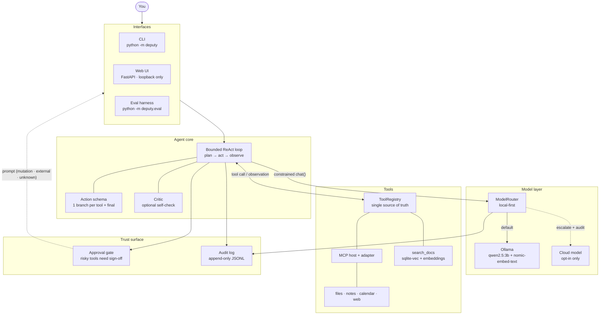

# Deputy

**A private, on-device AI agent that works your own files and runs tasks — and asks before it acts.**

**▶ [Try the live browser demo — no install](https://deputy-web-demo.onrender.com)** — it opens with a
scripted walkthrough of plan → tool → observation → approval → answer over sandboxed sample data. An
optional **experimental** mode downloads a WebLLM model and runs inference locally through WebGPU; no
prompt or sample data is sent to a backend.

**Repo:** [github.com/BhavyaV29/deputy-agent](https://github.com/BhavyaV29/deputy-agent) · **CI:** pytest + ruff + mypy on every push

Deputy runs a small local model (via [Ollama](https://ollama.com)) in a bounded agent loop, calls
tools through [MCP](https://modelcontextprotocol.io), retrieves from your own documents on-device, and
records every action while approval gates protect writes, external access, and tools with incomplete
safety metadata. Nothing leaves your machine unless you explicitly opt in; external tool calls also
require approval by default.

```text
$ uv run python -m deputy --real "What's on my calendar for 2026-07-08, and any related notes?"
[1] plan: list_events(date_or_range='2026-07-08..2026-07-08')
[1] list_events -> (ok) 2026-07-08 09:30-10:00  Phase 3 review @ home office ...
[2] plan: search_notes(query='Phase 3 review')
[2] search_notes -> (ok) [2026-07-07] prep slides for the Phase 3 review
[3] finished (answered): You have the Phase 3 review at 09:30; your notes mention prepping slides for it.
```

---

## Why

Most "AI assistants" are a text box wired to someone else's server. Deputy is the opposite bet:

- **Private by default.** The model, your files, the vector index, and the audit log all live on your
  machine. The only tool that touches the network is web search, and it is off unless you turn it on.
- **Works your own stuff.** Point it at a folder and it can search and read your files, look up your
  calendar, remember notes, and answer questions grounded in your own documents (with citations).
- **Asks before risky actions.** Confined, explicitly read-only local tools run freely; writes,
  external/open-world calls, and tools with incomplete safety metadata pause for a yes/no you actually
  see — in the terminal or the browser — and every step is appended to a plain-text audit log.
- **Reliable enough to trust the Python loop.** Every Python/Ollama model step is emitted under
  **constrained decoding** (a JSON schema passed to the runtime), so the agent can only ever produce a
  well-formed tool call or a final answer. On the Python app's reliability suite this lifts end-to-end
  task success from **29% → 88%** for `qwen2.5:3b` (see [Reliability](#reliability)).

---

## Features

Everything below is implemented and tested in this repo.

| Capability | What it does | Where |
| --- | --- | --- |
| **Bounded ReAct loop** | Plan → act → observe, up to a step ceiling; emits a structured event per transition. | `deputy/agent.py` |
| **Constrained tool-calling** | Each step is decoded against an `anyOf` schema — one branch per tool (name pinned, args typed) plus a final-answer branch — so output is always parseable into a typed action. | `deputy/actions.py`, `deputy/model.py` |
| **Local model runtime** | Blocking Ollama client behind a `ChatModel` protocol; tests inject a fake and never hit the network. | `deputy/model.py` |
| **Tools over MCP** | A synchronous host drives async stdio MCP servers; discovered tools are adapted into native `Tool`s, indistinguishable to the loop. | `deputy/mcp/` |
| **Built-in servers** | `files` (confined search/read), `notes` (add/search), `calendar` (read-only lookups), `web` (opt-in search — the only networked tool). | `deputy/servers/` |
| **On-device RAG** | Structure-aware chunking → Ollama embeddings → `sqlite-vec` store; `search_docs` prefers vector search, falls back to keyword, and cites source paths. | `deputy/rag/` |
| **Approval gates** | Policy auto-approves only classified local reads; mutations, external access, and unknown MCP tools require sign-off by default, with per-tool overrides. | `deputy/approvals.py` |
| **Audit log** | Append-only, `fsync`-ed JSONL under `data/`: planned actions, observations, approvals, denials, and exactly what any cloud escalation sent. Sensitive fields redacted. | `deputy/audit.py` |
| **Local-first routing** | The router *is* a `ChatModel`: local by default, with strictly opt-in, auditable cloud escalation that can't fire unless a cloud model was explicitly wired in. | `deputy/routing.py` |
| **Optional self-check** | A critic asks the model to grade its own draft (also under constrained decoding) before answering. | `deputy/critic.py` |
| **Local web UI** | FastAPI on loopback: chat, a live SSE action stream, in-browser approvals, and an audit view. | `deputy/web/` |
| **Reliability eval** | Runs the real Python/Ollama agent over a task suite with constrained decoding on vs off, scoring success, schema validity, and a trust metric. | `deputy/eval/` |

---

## Architecture



### Request → answer, step by step

1. **Goal in.** The CLI or web UI hands the loop a goal and builds an action schema from the tool
   registry — the registry is the single source of truth, so the model is only ever offered tools that
   actually exist.
2. **Plan (constrained).** The loop calls the model with that schema in the runtime's `format` field.
   Decoding is constrained, so the response is guaranteed to parse into either a **tool call** or a
   **final answer**.
3. **Gate.** If it's a tool call, the approval policy decides: explicitly local read-only tools are
   auto-approved; mutations, external access, and tools with incomplete MCP annotations pause for a
   human yes/no. A denial becomes an observation and the loop re-plans.
4. **Act & observe.** An approved call runs (over MCP or in-process); its result — or a caught fault —
   is threaded back as the next observation. Repeat until the goal is met or the step ceiling is hit.
5. **Answer (optionally self-checked).** On a final answer, an optional critic grades the draft against
   the goal and can send it back for another pass.
6. **Audit throughout.** Every planned action, observation, approval decision, denial, and any cloud
   escalation is appended to the audit log as it happens.

A deeper treatment — each layer, the alternatives considered, and why the current design — lives in
[`docs/architecture.md`](docs/architecture.md).

---

## Quick start

**Prerequisites:** [Ollama](https://ollama.com), Python 3.12, and [`uv`](https://docs.astral.sh/uv/).

```bash
# 1. Pull the models Deputy uses (chat + embeddings). Make sure `ollama serve` is running.
ollama pull qwen2.5:3b
ollama pull nomic-embed-text

# 2. Install Deputy's commands (deputy, deputy-web, deputy-app) onto your PATH.
uv tool install .    # or just `uv sync` to run inside this checkout with `uv run …`
```

### Use it like an app (recommended)

`deputy-app` is **launch-once, use-continuously**: it starts the local server, opens it in your
browser, and stays running until you close it. Re-run it whenever — if Deputy is already up it just
reopens that tab; if the port is busy it picks the next free one — so launching never errors.

```bash
deputy-app                 # start the UI + open http://127.0.0.1:8000, and keep running
deputy-app --window        # open a native desktop window instead of a browser tab (see note)
deputy-app --no-browser    # just serve (for background / start-on-login use)
```

**No terminal at all (macOS):**

- **Double-click to launch** — open [`scripts/Deputy.command`](scripts/Deputy.command) from Finder
  (right-click → *Open* the first time to clear Gatekeeper). It runs `deputy-app` and leaves a small
  Terminal window as the "Deputy is running" indicator; close it to stop.
- **Start on login (opt-in)** — install the LaunchAgent template so Deputy is always ready:

```bash
cp scripts/com.deputy.app.plist ~/Library/LaunchAgents/com.deputy.app.plist
# first edit the __DEPUTY_APP__ / __WORKDIR__ / __LOG_DIR__ placeholders inside it, then:
launchctl bootstrap gui/$(id -u) ~/Library/LaunchAgents/com.deputy.app.plist   # enable
launchctl bootout   gui/$(id -u) ~/Library/LaunchAgents/com.deputy.app.plist   # disable
```

> **Native window** needs one optional dependency — install with `uv sync --extra app` (or
> `uv tool install ".[app]"`), which adds [`pywebview`](https://pywebview.flowrl.com). Without it,
> `--window` simply falls back to a browser tab.

### Or use the CLI / plain server

```bash
# (optional) Build an on-device index over some documents — try the bundled sample corpus.
uv run python -m deputy.rag.index sample_workspace

# One-shot CLI tasks:
uv run python -m deputy "what is 12 * (3 + 4)?"                          # trivial demo tools
uv run python -m deputy --real "what's on my calendar for 2026-07-08?"   # real tools + RAG

# The plain web server (no auto-open) — same UI, handy for scripts / service managers:
uv run python -m deputy.web                                              # http://127.0.0.1:8000
```

The web server binds `127.0.0.1` only — Deputy is local-first, so the UI is never reachable off-host.

### Common flags

| Flag | CLI | Web | Meaning |
| --- | --- | --- | --- |
| `--real` | ✓ | (always on) | Use the built-in MCP servers + RAG instead of the demo tools. |
| `--model` | ✓ | ✓ | Ollama chat model tag (default `qwen2.5:3b`). |
| `--max-steps` | ✓ | ✓ | Step ceiling for the loop (default `8`). |
| `--critic` | ✓ | ✓ | Self-check the draft answer before returning it. |
| `--yes` | ✓ | — | Auto-approve gated tools (non-interactive scripting). |
| `--port` | — | ✓ | Loopback port (default `8000`; `deputy-app` advances to the next free port if busy). |
| `--window` | — | app | `deputy-app` only: open a native desktop window (needs the `app` extra). |
| `--no-browser` | — | app | `deputy-app` only: start the server without auto-opening anything. |

---

## Usage examples

**Find a topic across your files and summarize with sources.** `search_files` locates the mentions,
`search_docs` pulls the passages, and the model summarizes — citing the files.

```text
$ uv run python -m deputy --real "Find everywhere sqlite-vec is mentioned across my files and summarize, with sources."
[1] plan: search_files(query='sqlite-vec')
[1] search_files -> (ok) meetings/2026-07-08-review.md ... projects/deputy.md ...
[2] plan: search_docs(query='sqlite-vec')
[2] search_docs -> (ok) [1] projects/deputy.md ... [2] meetings/2026-07-08-review.md ...
[3] finished (answered): sqlite-vec is referenced in two docs: projects/deputy.md (used for retrieval,
    storing chunk text beside vector embeddings) and meetings/2026-07-08-review.md (chosen over a flat scan).
```

**Save a note — a write, so it pauses for approval.**

```text
$ uv run python -m deputy --real "Please save a note: prep slides for the Phase 3 review"
[1] plan: add_note(text='prep slides for the Phase 3 review')
[approval] write `add_note(text='prep slides for the Phase 3 review')` — Save a short note for later.
approve? [y/N] y
[1] add_note -> (ok) Saved note at 2026-07-08T21:02:23+00:00.
[2] finished (answered): Saved your note.
```

Add `--yes` to auto-approve gated tools when scripting. Every one of these steps also lands in the
audit log at `data/audit.jsonl`.

---

## Reliability

Constrained decoding is the load-bearing reliability lever in the **Python/Ollama app**. Its eval
harness runs the real Python agent over a 17-task suite (tool selection, multi-step reasoning, RAG,
approval-gating, graceful failure, refusal) with the action schema passed to Ollama (`grammar`) vs
dropped (`freeform`), and grades the outcomes with deterministic programmatic checks — no LLM judge.

**`qwen2.5:3b`, constrained vs unconstrained decoding:**

| Metric | freeform | grammar | Δ |
| --- | --- | --- | --- |
| Task success | 29.4% | **88.2%** | +58.8 pts |
| Schema-valid steps | 71.1% | **100.0%** | +28.9 pts |
| Loop crashes (parse failures) | 11 | **0** | −11 |
| Trust (mutations gated) | 100.0% | 100.0% | — |

The action schema constrains *shape*, not *choice*: it forces every step into a well-formed call or a
final answer, removing the malformed-JSON errors that otherwise break an agent loop by construction
rather than by prompt-tweaking. The **trust metric stays at 100% in both modes** — every attempted
write was gated regardless of how the step was decoded, because approval is enforced by the loop, not
by the model's cooperation.

Full tables (including `llama3.2:3b` and a per-category breakdown) are in
[`docs/eval_results.md`](docs/eval_results.md); the original call-level spike is in
[`docs/spike_results.md`](docs/spike_results.md). Reproduce with:

```bash
uv run python -m deputy.eval --model qwen2.5:3b
```

---

## Trust & privacy

Deputy's trust surface is a first-class part of the design, not a setting:

- **Local by default.** The model, embeddings, index, notes, calendar, and audit log are all on-device
  under `data/` (gitignored). Cloud escalation is impossible unless a cloud model is *explicitly* wired
  in — a misconfigured policy alone can never push data off the machine.
- **Approval gates fail closed.** Only explicitly read-only, confined local tools run freely. Mutations
  (e.g. `add_note`), external/open-world tools (e.g. `web_search`), and tools with missing or ambiguous
  MCP safety annotations require a yes/no by default. Per-tool `allow` / `prompt` / `deny` overrides
  remain available through `DEPUTY_TRUST`.
- **A real audit trail.** Every meaningful moment is one JSON line you can `tail` in real time.
  Known-sensitive fields are redacted; tool output is summarized to keep the log lean.
- **Opt-in cloud, fully logged.** If you enable escalation (`DEPUTY_CLOUD_ENABLED=1` **and** a key),
  every escalation records the reason, provider, model, a preview, and a SHA-256 digest of exactly what
  crossed the boundary — *before* the request leaves.

```bash
# Fully local (default): no configuration needed.
# Opt into cloud escalation for large transcripts:
export DEPUTY_CLOUD_ENABLED=1
export DEPUTY_CLOUD_API_KEY=sk-...          # required; without it, escalation stays off
export DEPUTY_TRUST="add_note=deny"         # example: never allow note writes
```

---

## Demo

Two ways to see Deputy work: the **in-browser walkthrough** below (no install), or the full Python app
on your own machine.

### Try it in your browser — no install

[`web-demo/`](web-demo/) is a self-contained static illustration. The default experience is a
**scripted walkthrough**: model decisions are pre-recorded, while the browser-side tools, observations,
approval pause, and session audit run live over an in-memory sample corpus. Click **Run it for real
(experimental)** to opt into a one-time model download and live WebLLM/WebGPU inference.

The experimental WebLLM path prompts for one JSON action and uses a tolerant parser plus retries; it
does **not** use the Python/Ollama app's runtime-enforced schema decoding. The Python/Ollama app is the
real constrained-decoding implementation, and the [reliability results](#reliability) apply to that app
only.

- **Live demo:** **<https://deputy-web-demo.onrender.com>** — live now, no install required. Published from `web-demo/` via the repo's [`render.yaml`](render.yaml) as a [Render](https://render.com) Static Site with no build step; it's plain static files, so any static host (Netlify / Vercel / GitHub Pages) works too.
- **Run locally:** `cd web-demo && python3 -m http.server 8000`, then open `http://localhost:8000`.
- **Modes:** scripted is the default; `?fallback=1` pins that mode. `?live=1` or the in-page button
  enters the optional experimental WebGPU path when the browser supports it.

### Run the full app locally

Want the real thing on your own files? Install via [Quick start](#quick-start), then start the web UI
with `deputy-app` (or `uv run python -m deputy.web`) and open `http://127.0.0.1:8000`. A good
end-to-end flow to try:

1. **Start a task** in the chat box, e.g. *"Save a note: call the dentist tomorrow, then confirm."*
2. Watch the **live action stream** — each step's plan and the tool observation appear as they happen.
3. **Hit an approval** — the mutating `add_note` call pauses with **Approve / Deny** buttons.
4. **Approve it**, and let the run finish with a final answer.
5. Switch to the **Audit** tab to see the recorded run: planned actions, the approval decision, and
   the observation.

---

## Project layout

```text
src/deputy/
  agent.py         bounded ReAct loop
  actions.py       action schema + parser (constrained decoding contract)
  model.py         Ollama client + ChatModel/Embedder protocols
  tools.py         Tool + ToolRegistry
  prompts.py       system prompt + transcript text
  approvals.py     approval policy + prompter seam
  audit.py         append-only JSONL audit log (write + query)
  routing.py       local-first ModelRouter + opt-in cloud client
  critic.py        optional answer self-check
  config.py        env-driven runtime config
  app.py           assembles the real agent (servers + RAG + trust surface)
  demo.py          trivial tools for driving the loop without --real
  mcp/             synchronous host + adapter over async MCP servers
  servers/         built-in stdio MCP servers (files/notes/calendar/web)
  rag/             chunk / store (sqlite-vec) / search / index
  web/             FastAPI loopback UI (SSE stream, approvals, audit)
  eval/            reliability eval harness
  spike/           the Phase-1 constrained-decoding spike
tests/             207 offline tests + 1 opt-in Ollama integration test
docs/              architecture, eval results, build-in-public notes
sample_workspace/  a small corpus to index and query out of the box
```

---

## Development

```bash
uv run pytest -q        # 207 pass offline; 1 Ollama integration skips if unavailable
uv run ruff check .     # lint
uv run mypy             # strict type-checking
```

The agent core depends only on protocols (`ChatModel`, `Embedder`, and the tool/approval/event seams),
so the whole suite runs offline against fakes and never needs a live Ollama.

Packaging Deputy as a standalone desktop command is documented in
[`docs/packaging.md`](docs/packaging.md).

---

## Status & license

Working end-to-end across its core phases (agent core, MCP tools, on-device RAG, trust surface, web UI,
and a reliability eval), with 207 offline tests, one opt-in Ollama integration test, and clean `ruff` +
strict `mypy`. It is a personal project and a focused demonstration rather than a supported product.

Licensed under the [MIT License](LICENSE).
