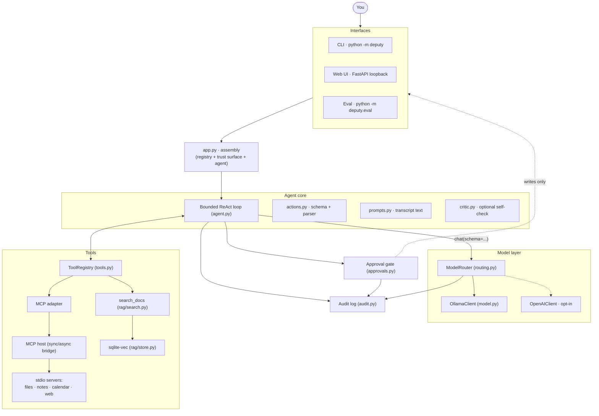
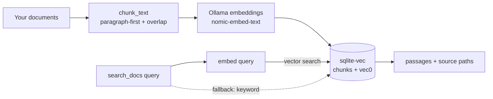

# Deputy — architecture

This document explains how Deputy is built, layer by layer, and — more usefully — *why* each layer is
built the way it is: the alternatives that were on the table and the reasons the current design won.
It assumes you've skimmed the [README](../README.md).

## Design principles

Four constraints shape almost every decision below.

1. **On-device by default.** The model, your files, the index, and the audit log stay on your machine.
   Anything that could leave the device is off unless explicitly enabled *and* wired in.
2. **The loop is enforced, the model is not trusted.** Reliability and safety come from the code around
   the model — a schema it must decode into, a gate its writes must pass, a log it can't skip — not from
   asking the model to behave. The [eval](eval_results.md) is what keeps this honest.
3. **Seams are protocols; implementations are swappable.** The core depends on small interfaces
   (`ChatModel`, `Embedder`, `EventSink`, `ApprovalCallback`, `Prompter`, `Connector`), so every layer
   is testable against a fake and the whole suite runs offline.
4. **Prefer boring, inspectable machinery.** A blocking loop, plain-text logs, one SQLite file, a
   loopback web server. Complexity is added only where it earns its keep (e.g. the MCP host).

## System overview



Assembly happens in one place. `deputy/app.py` turns a `DeputyConfig` into a live `ToolRegistry`
(built-in MCP servers + the native retrieval tool) and wires the agent behind the trust surface. Both
the CLI (`deputy/__main__.py`) and the web service (`deputy/web/service.py`) call the same
`build_agent()`, so they are guaranteed to run an identical loop, approver, and audit path.

---

## 1. Agent core — the bounded ReAct loop

**What it is.** `Agent.run(goal)` (`deputy/agent.py`) is a `for` loop over a step ceiling
(`AgentConfig.max_steps`, default 8). Each iteration asks the model for one action, then either finishes
(final answer), gates-and-runs a tool, or handles a denial. Every transition is emitted as a typed
`Event` (`ActionPlanned`, `ToolObserved`, `ActionDenied`, `AnswerRejected`, `RunFinished`) to an
optional sink. It returns an `AgentResult` with the answer (or `None` if the ceiling was hit), the step
count, a `StopReason`, and the full event tuple.

**Key decisions.**

- **Hand-built, not a framework.** Deputy deliberately does not use LangChain/LlamaIndex/etc. The loop
  is ~130 lines and depends only on protocols. That buys three things frameworks make harder here:
  (a) an exact, auditable step contract (one JSON action per turn); (b) trust seams — approval and
  audit — that wrap *every* step by construction; (c) a core that tests against fakes with zero heavy
  dependencies. The cost — writing the loop yourself — is small and one-time.
- **A parse failure is a bug, not a retry.** Because decoding is constrained (§2), a step is guaranteed
  parseable. So `parse_action` failing means a real misconfiguration, and the loop *surfaces* it rather
  than silently looping — the opposite of the usual "reprompt until it's valid" pattern, which
  constrained decoding makes unnecessary.
- **Observations are `user` turns, not the runtime's `tool` role.** The loop runs its own JSON action
  protocol (`prompts.py`), so it never depends on any one runtime's tool-calling semantics. This keeps
  the loop model-agnostic: the same protocol drives any `ChatModel`.
- **Bounded by default.** A step ceiling means a run always terminates with a definite reason, which is
  what makes runs auditable and the eval's "avg steps" and "crashes" meaningful.

---

## 2. Constrained decoding — the central bet

**What it is.** `action_schema(registry)` (`deputy/actions.py`) builds a JSON Schema that is an `anyOf`
of one branch per tool — `{"tool": {"const": name}, "args": <tool's parameter schema>}` — plus a
final-answer branch `{"final": string}`. The loop passes this to the model via `OllamaClient.chat`,
which sets Ollama's `format` field to the schema. Decoding is thereby constrained to schema-valid output,
and `parse_action` recovers a typed `ToolCall | FinalAnswer`.

**Why it's the load-bearing choice.** The schema constrains *shape*, not *choice*: it forces every step
to be a well-formed call to a real tool or a final answer, which removes the entire class of
"malformed / over-decorated JSON" errors that break an agent loop. It does not decide *which* tool
fits, so routing quality still tracks the model. This is measured, not asserted:

- Call-level [spike](spike_results.md): 100.0% schema-valid constrained vs 98.6% unconstrained.
- Task-level [eval](eval_results.md) for `qwen2.5:3b`: schema validity 71.1% → 100.0%, task success
  29.4% → 88.2%, and **11 → 0 loop crashes** — the parse failures constrained decoding removes by
  construction.

**Alternatives considered.**

- *Prompt engineering + regex extraction.* Reduces but never eliminates malformed output; every
  remaining failure is a loop crash. Rejected — it fights the symptom.
- *Reprompt-until-valid retries.* Wastes tokens and latency and still has a failure tail. Constrained
  decoding makes it moot.
- *The runtime's native function-calling API.* Ties the loop to one runtime's tool semantics; Deputy's
  JSON protocol keeps it portable across any model that can emit JSON under a schema.

---

## 3. Model layer

**What it is.** `deputy/model.py` defines the `ChatModel` and `Embedder` protocols and the real
`OllamaClient`. `chat()` posts to `/api/chat` with the schema in `format`; `embed()` posts to
`/api/embed`. Responses carry Ollama's decode counters (`eval_count`, `eval_duration`) so the eval can
compute tokens/sec. The client is a context manager over a single `httpx.Client`.

**Decisions.**

- **Ollama as the runtime.** It offers a simple local HTTP API, one-command model management
  (`ollama pull`), and — decisively — first-class structured outputs via the `format` field, which is
  the exact mechanism §2 depends on. Alternatives: raw `llama.cpp` (GBNF grammars work but you own
  model management and serving), LM Studio (GUI-centric), vLLM (heavier, GPU-oriented), hosted APIs
  (defeat the on-device goal). Because everything sits behind `ChatModel`, swapping runtimes is a
  single class.
- **Protocols over concrete clients.** The agent depends on `ChatModel`, never on `OllamaClient`. Tests
  inject a scripted fake; the router (§8) implements the same protocol so the agent uses it unchanged;
  the cloud client (§8) is just another implementation.
- **Blocking, not async.** The core is synchronous on purpose (simpler to read, test, and reason
  about). Async is introduced only at the two seams that genuinely need it — the MCP host (§5) and the
  web stream (§9).

---

## 4. Tools and the registry

**What it is.** `deputy/tools.py` defines `Tool` (name, description, JSON-Schema `parameters`, a
`handler`, and a `mutating` flag) and `ToolRegistry`. The registry is the **single source of truth**:
both `action_schema()` and the system prompt are derived from it, so the model can only ever be offered
tools that actually exist, and adding a tool automatically updates both the grammar and the prompt.

A tool sourced over MCP and a native in-process tool (like `search_docs`) are the same `Tool` type once
registered — the loop cannot tell them apart, which is what lets §5 and §6 coexist behind one interface.

---

## 5. MCP integration — a synchronous host over async servers

**What it is.** `deputy/mcp/host.py` connects to [MCP](https://modelcontextprotocol.io) servers,
discovers their tools, and exposes **blocking** `list_tools()` / `call_tool()`. `deputy/mcp/adapter.py`
maps each `DiscoveredTool` onto a native `Tool` whose handler dispatches back through the host.

**The hard part, and why it's shaped this way.** The MCP SDK is async, and its client sessions hold
anyio cancel scopes that must be entered and exited *on the same task*. The agent loop is blocking.
The host reconciles the two by owning a private event loop on a daemon thread: one long-lived caretaker
coroutine opens every session and later closes them (satisfying anyio), while tool calls are dispatched
onto that loop from the calling thread via `run_coroutine_threadsafe` and awaited synchronously.

```mermaid
sequenceDiagram
    participant Loop as Agent loop (main thread)
    participant Host as McpHost
    participant EL as Event loop (daemon thread)
    participant Care as Caretaker coroutine
    participant Srv as stdio MCP server

    Loop->>Host: start()
    Host->>EL: run_forever()
    EL->>Care: open sessions
    Care->>Srv: initialize + list_tools
    Care-->>Host: ready (tools discovered)
    Loop->>Host: call_tool(server, name, args)
    Host->>EL: run_coroutine_threadsafe(call)
    EL->>Srv: call_tool
    Srv-->>EL: result
    EL-->>Loop: result (blocking .result())
    Loop->>Host: stop()
    Host->>Care: set shutdown event
    Care->>Srv: close sessions (same task)
```

**Decisions.**

- **MCP over a bespoke plugin interface.** Tools become reusable across any MCP host, and the loop stays
  agnostic to where a tool lives. The cost is exactly the sync/async bridge above — paid once, in one
  file.
- **Transport faults become observations.** A failed call raises `McpToolError`, which the loop catches
  and turns into a `(error)` observation, so a flaky tool degrades the run instead of crashing it.
- **`memory_connector` for tests.** An in-process connector runs a `FastMCP` server object with no
  subprocess, so MCP behaviour is tested without spawning processes.

---

## 6. Built-in servers and the mutating flag

Each server in `deputy/servers/` is a self-contained stdio MCP server; the tool logic lives in plain
functions (unit-tested directly) behind a thin MCP shell that reads its location from the environment.

| Server | Tools | Mutating | Safety constraint |
| --- | --- | --- | --- |
| `files` | `search_files`, `read_file` | no | Every path is resolved and checked to fall under the workspace root; `..`, absolute paths, and out-of-tree symlinks raise `PathEscapeError`. |
| `notes` | `add_note`, `search_notes` | `add_note` **yes** | Append-only JSONL; `add_note` declares `readOnlyHint=False` so the host tags it mutating. |
| `calendar` | `list_events` | no | Read-only over a local JSON store; a date or an inclusive `A..B` range. |
| `web` | `web_search` | no | **Opt-in** — only registered when `DEPUTY_WEB_SEARCH_ENABLED` is set. The only tool that reaches the network. |

**Mutation is derived, not guessed.** `McpHost._is_mutating` reads the standard MCP annotations: a tool
is mutating only if it declares `destructiveHint` or sets `readOnlyHint=False`. Absent hints mean
read-only, so the approval gate (§7) stays reserved for genuine side effects rather than desensitizing
you with a prompt on every lookup.

---

## 7. On-device RAG

**Pipeline.** `deputy/rag/` is chunk → embed → store → search.

- **Chunking (`chunk.py`).** Structure-aware: split on paragraphs first, break only oversized
  paragraphs down to words, and carry a trailing paragraph of overlap between consecutive chunks so a
  match that straddles a boundary is still retrievable. A chunk is a coherent passage, not an arbitrary
  slice.
- **Store (`store.py`).** `sqlite-vec`. Chunk text and metadata (path, ordinal) live in an ordinary
  table; embeddings live in a sibling `vec0` virtual table keyed by the same rowid, so nearest-neighbour
  search is a join. The same DB answers keyword queries (`LIKE`) directly — the fallback path.
- **Search (`search.py`).** `DocRetriever` prefers vector search and silently falls back to keyword
  search when the embedder is offline or returns nothing, so retrieval degrades instead of failing.
  Every hit carries its source path, so answers can be cited and the file opened for more.
- **Index (`index.py`).** `python -m deputy.rag.index <dir>` walks a directory, chunks and embeds each
  document, and writes the store. The embedding dimension is learned from the first vector, so the store
  adapts to whatever model is configured.



**Decisions.**

- **`sqlite-vec` over FAISS / Chroma / pgvector / a numpy scan.** One local file, no server to run,
  keyword fallback shares the same database, and it scales past a toy corpus — the right weight for a
  personal, on-device tool. A hand-rolled numpy scan would need its own persistence and wouldn't share
  storage with the fallback.
- **`nomic-embed-text` (768-dim, ~274 MB).** Small, fast, and a solid default for local text retrieval,
  pulled through the same Ollama the chat model uses.
- **`search_docs` is native, not MCP.** It needs the injected `Embedder`; routing it through a
  subprocess would mean a second Ollama client for no benefit. It still lands in the same registry as
  the MCP tools and is indistinguishable to the loop.

---

## 8. The trust surface

Three cooperating pieces — approvals, audit, and routing — turn "an agent that acts" into "an agent you
can let act."

### Approvals (`approvals.py`)

The important idea is that **deciding whether approval is needed is split from obtaining it.**
`policy_approver` decides: reads are auto-approved, writes require sign-off, and explicit per-tool
`TrustLevel` overrides (`allow` / `prompt` / `deny`) win. When sign-off is needed it hands an
`ApprovalRequest` to a `Prompter` — and the prompter is just a seam:

- `cli_prompter` — a terminal `y/N`.
- `auto_prompter` — a canned answer for scripting/tests (`--yes`).
- the web UI — surfaces the request as an **Approve/Deny** button and resolves it on click.

The loop is identical in all three cases. `recording_approver` wraps whichever approver is in use so
every decision is written to the audit log.

### Audit log (`audit.py`)

A durable, append-only JSONL file under `data/`. Each meaningful moment — planned action, observation,
approval, denial, answer rejection, run finish, and any cloud routing — is one JSON line, written with
`flush` + `os.fsync` (an audit record you can't rely on isn't one).

- **Why JSONL.** Plain text you can `tail` while Deputy works is itself part of the trust surface. It's
  append-only, trivially durable, and needs no schema migration. The read side is a small query API
  (`records`, `by_run`, `recent`, `runs`) — a linear scan, which is fine at personal scale. A structured
  DB would buy query power the use case doesn't need and cost the human-readability the trust story
  depends on.
- **Redaction and summarization.** Known-sensitive argument keys (passwords, tokens, keys, …) are
  redacted recursively; observations are previewed to keep the log lean. For cloud escalations the log
  records a preview *and* a SHA-256 digest of exactly what crossed the boundary.

### Local-first routing (`routing.py`)

`ModelRouter` is itself a `ChatModel`, so the agent uses it in place of a bare client and needs no
change. It prefers the local model and escalates only when a cloud model is *wired in* **and** an
escalation policy asks for it (e.g. `escalate_when_larger_than(chars)`). Two safeguards make
data-egress a deliberate act:

1. Escalation is structurally impossible unless a cloud client was explicitly constructed — a
   misconfigured policy alone can never push data off the device (`_should_escalate` returns `None`
   when `cloud is None`).
2. Every escalation is announced to the recorder *before* the request leaves, and an optional
   `Minimizer` can shape what actually goes out.

`config.py` gates the cloud client behind `cloud_ready` — enabled **and** holding an API key — so the
default posture is fully local with no way off the machine.

```mermaid
sequenceDiagram
    actor You
    participant UI as CLI / Web
    participant Loop as Agent loop
    participant Model as ModelRouter → Ollama
    participant Gate as Approval policy
    participant Audit as Audit log

    You->>UI: goal
    UI->>Loop: run(goal)
    loop until final answer or max_steps
        Loop->>Model: chat(messages, schema)
        Model-->>Loop: constrained action
        Loop->>Audit: ActionPlanned
        alt tool call
            Loop->>Gate: approve(call)
            alt write (mutating)
                Gate->>UI: prompt (y/N or button)
                UI-->>Gate: decision
            else read-only
                Gate-->>Loop: auto-approved
            end
            Gate->>Audit: approval decision
            Loop->>Loop: run tool, capture observation
            Loop->>Audit: ToolObserved
        else final answer
            Loop->>Audit: RunFinished
        end
    end
    Loop-->>You: answer
```

---

## 9. Configuration (`config.py`)

`DeputyConfig.from_env()` resolves everything from the environment with local defaults, and all runtime
state lives under one `data/` directory so it can be gitignored wholesale — nothing about your machine
leaks into the repo. Paths are resolved to absolutes because the built-in servers run as subprocesses
with their own working directory. The cloud settings follow the same local-first rule: off unless
switched on *and* given a key.

Notable knobs: `DEPUTY_WORKSPACE_ROOT`, `DEPUTY_EMBEDDINGS_MODEL`, `DEPUTY_TRUST` (per-tool overrides),
`DEPUTY_WEB_SEARCH_ENABLED`, and the `DEPUTY_CLOUD_*` family.

---

## 10. Local web UI (`web/`)

**What it is.** A FastAPI app (`create_app`) bound to `127.0.0.1` only, serving a single-page UI:
chat, a live action stream over Server-Sent Events, in-browser approvals, and an audit view. Routes:
`POST /chat`, `GET /events/{run_id}` (SSE), `POST /approvals/{run_id}/{id}`, `GET /api/audit`, `GET /`.

**The sync/async bridge.** The agent loop is blocking; the browser speaks async HTTP. Each run executes
on a worker thread while a `RunSession` (`web/runs.py`) marshals output back onto the event loop: events
and approval prompts are pushed to an `asyncio.Queue` via `call_soon_threadsafe`, and an approval parks
the worker on a `concurrent.futures.Future` that the approve/deny endpoint completes from the loop. The
agent core is untouched — **the UI is simply another implementation of the existing `Prompter` seam.**

**Decisions.**

- **Loopback-only.** A private, local-first agent shouldn't be reachable off-host; binding `127.0.0.1`
  makes that structural.
- **FastAPI + SSE over a heavier desktop stack (Electron, etc.).** No new heavy dependencies, reachable
  in any browser, and SSE is the natural fit for a one-way live action stream. WebSockets would be
  overkill for a single-user, mostly-downstream feed.
- **Runs serialized behind a lock.** The model client and MCP servers are shared single-user state, and
  a local UI never needs two concurrent runs — a lock is simpler and safer than pooling.

---

## 11. Reliability eval (`eval/`)

The eval measures the **shipping system**, not a stand-in: `run_task` assembles the same bounded loop
behind the same `policy_approver` and action schema that `build_agent` wires for the CLI and web. The
only deliberate substitutions are the experimental lever and the fixtures:

- `InstrumentedModel` realizes the on/off axis — `GRAMMAR` passes the action schema to the runtime,
  `FREEFORM` drops it — and records per-call telemetry (latency, schema-valid, decode counters).
- The tool world (`environment.py`) is a deterministic in-process fixture so the harness measures the
  *model*, not variable I/O; mutating tools record intent against isolated per-task state.
- `ApprovalProbe` withholds approval by default (nothing writes without a human) while recording that
  the gate engaged — which is how the **trust metric** (fraction of attempted mutations that stayed
  gated) is computed.
- A task that raises out of the loop — the exact failure constrained decoding prevents — is caught and
  scored as a failure, not a crash.

See [`eval_results.md`](eval_results.md) for the numbers and [`spike_results.md`](spike_results.md) for
the earlier call-level experiment that motivated the bet.

---

## Cross-cutting: testing strategy

Every external dependency sits behind a protocol, so the 189-test suite runs offline and fast:

- `ChatModel` / `Embedder` → scripted fakes (no Ollama).
- MCP → `memory_connector` runs real `FastMCP` servers in-process (no subprocesses).
- The web routes depend on the `AgentService` protocol → a scripted service (no live model, no network).
- Server tool logic is plain functions tested directly; the MCP shell is thin.

This is the practical payoff of principle #3: the trust-critical code (schema, approvals, audit,
routing) is unit-tested deterministically, and the eval covers the emergent, model-dependent behaviour.

## Non-goals and known limitations

- **Single-user, single-machine.** No multi-tenant auth, no remote access; the web UI is loopback by
  design.
- **Audit queries are linear scans.** Correct and simple at personal scale; not built for millions of
  records.
- **RAG indexing is a batch command.** There's no file watcher; re-run `deputy.rag.index` to refresh.
- **Small local models have a routing ceiling.** Constrained decoding fixes *shape*, not *judgment*;
  the multi-step category in the eval is where a 3B model's reasoning, not its formatting, is the limit.
